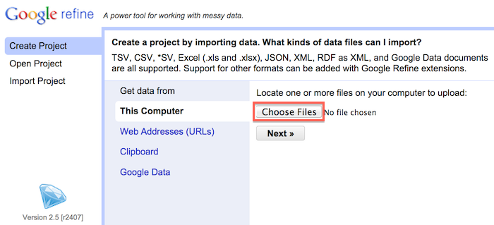

# Lesson

## Features
* Open source ([source on GitHub](https://github.com/OpenRefine/OpenRefine)).
* A large growing community, from novice to expert, ready to help.
* Works with large-ish datasets (100,000 rows). Does not scale to many millions. (yet).
* Knowledge of JSON, GREL, or other coding languages isn't required to use the basic functions.

## Motivations for the OpenRefine Lesson

* It is important to know what you did to your data, to replicate the steps later, or to be able to share with others. With OpenRefine, you can capture all actions applied to your raw data and share them with your publication as supplemental material.
* All actions are easily reversed in OpenRefine.
* You _must_ save your work to a new file; OpenRefine _does not_ modify your original dataset.
* Data is often very messy, and this tool saves a lot of time on cleaning headaches.
* Data cleaning steps often need repeating with multiple files. OpenRefine is perfect for speeding up repetitive tasks by replaying previous actions on multiple datasets.
* Some concepts such as clustering algorithms are quite complex, but OpenRefine makes it easy to introduce them, use them, and show their power.

## Before we get started

Note: this is a Java program that runs on your machine (not in the cloud). It runs inside your browser, but no web connection is needed.

Follow the [Setup](https://github.com/OpenRefine/OpenRefine/wiki/Installation-Instructions) instructions to install OpenRefine. Note: if you are going to be running large datasets (using more than 3GB of RAM), you may need to install a Java memory extension, which you can install using [these instructions](https://github.com/OpenRefine/OpenRefine/wiki/FAQ:-Allocate-More-Memory).

If after installation, open the OpenRefine.exe file which will open a command window and your default browser. If it does not automatically open for you, point your browser at http://127.0.0.1:3333/ or http://localhost:3333 to launch the program.

## Creating a Project

Start the program. (Double-click on the openrefine.exe file. Java services will start on your machine, and OpenRefine will open in your browser).

Launch OpenRefine.

OpenRefine can import a variety of file types, including tab separated (`tsv`), comma separated (`csv`), Excel (`xls`, `xlsx`), JSON, XML, RDF as XML, Google Spreadsheets. See the [OpenRefine Importers page](https://github.com/OpenRefine/OpenRefine/wiki/Importers) for more information.

In this first step, we'll browse our computer to the sample data file for this lesson. 

If you haven't already, download the data from:  
[Google Sheets](https://docs.google.com/spreadsheets/d/1BlEaMI_RLPSpQWX7FUwMI4y4xDjEHknctSWRpghNGTE/edit#gid=379038397)

Once OpenRefine is launched in your browser, the left margin has options to `Create Project`, `Open Project`, or `Import Project`. Here we will create a new project:

> ## Exercise
>
> 1. click `Create Project` and select `Get data from` `This Computer`.  
> 2. Click `Choose Files` and select the file `OpenRefine Workshop Sample Scopus Data.csv`. Click `Open` or double-click on the 
> filename.
> 3. Click `Next>>` under the browse button to upload the data into OpenRefine.  
> 4. OpenRefine gives you a preview - a chance to show you it understood the file. If, for example, your file was really tab-delimited,
> the preview might look strange, you would choose the correct separator in the box shown and click `Update Preview` (bottom left). If
> this is the wrong file, click `<<Start Over` (upper left).  
> 5. If all looks well, click `Create Project>>` (upper right). 

>> Note that at step 1, you could upload data in a standard form from a web address by selecting `Get data from` `Web Addresses (URLs)`. >> However, this won't work for all URLs.

## Layout

OpenRefine displays data in a tabular format. Each row will represent a 'record' in the data, while each column represents a type of information. This is very similar to how you might view data in a spreadsheet or database, and individual bits of data are housed in 'cells' at the intersection of a row and a column. Most of the actions that you can perform in OpenRefine are centered around filtering, adjusting, cleaning, or manipulating data in each 'record' or column to meet your needs.

OpenRefine only displays a certain number of records at a time. The default display is 10 rows, but this can be changed to 5, 25, or 50 (keep in mind that the greater number of rows displayed, the longer it may take data with lots of columns to load) by selecting the appropriate display in the top right corner. You can navigate through the rows by using the First/Previous/Next/Last arrows in the top right corner of the screen. The left side of the screen displays options for Faceting, and the Undo/Redo options available.

## Additional Resources

You can find out a lot more about OpenRefine at [http://openrefine.org](http://openrefine.org) and check out some great introductory videos. There is a [Google Group](https://groups.google.com/forum/?hl=en#!forum/openrefine) that can answer a lot of beginner questions and problems. There is also an [OpenRefine Google Plus community](https://plus.google.com/communities/117280693504889048168) where you can find a lot of help and a lot of folks from the life sciences are members. As with other programs of this type, OpenRefine libraries are available too, where you can find a script you need and copy it into your OpenRefine instance to run it on your dataset.
