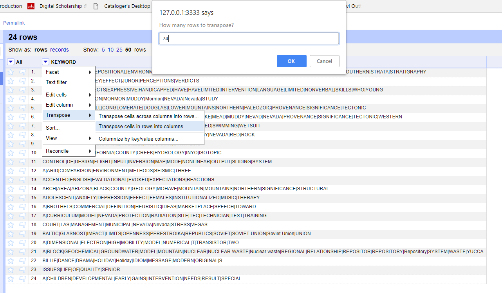
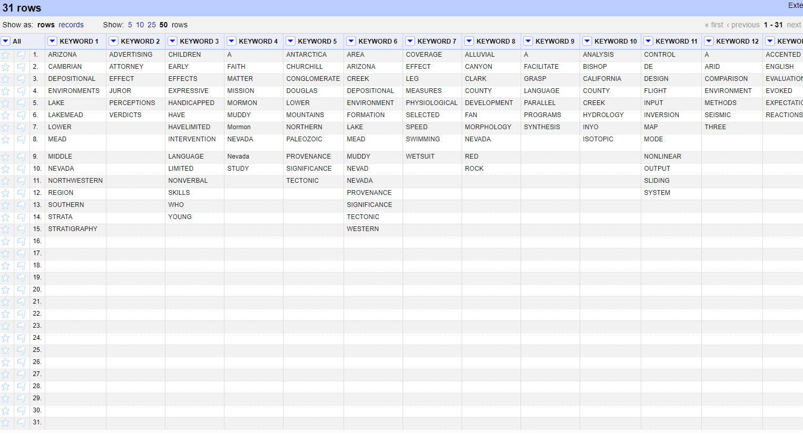
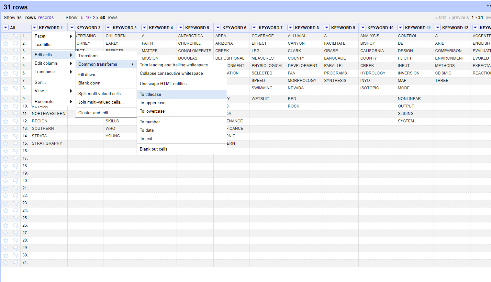
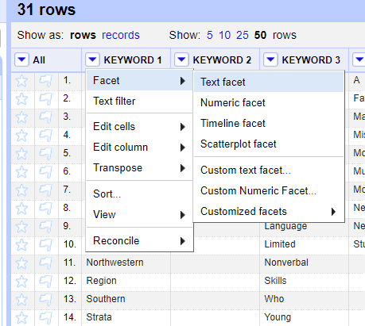
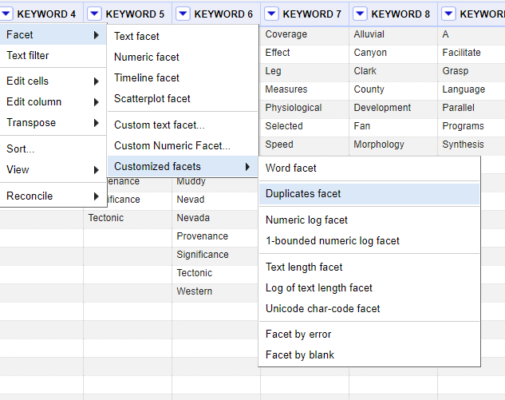
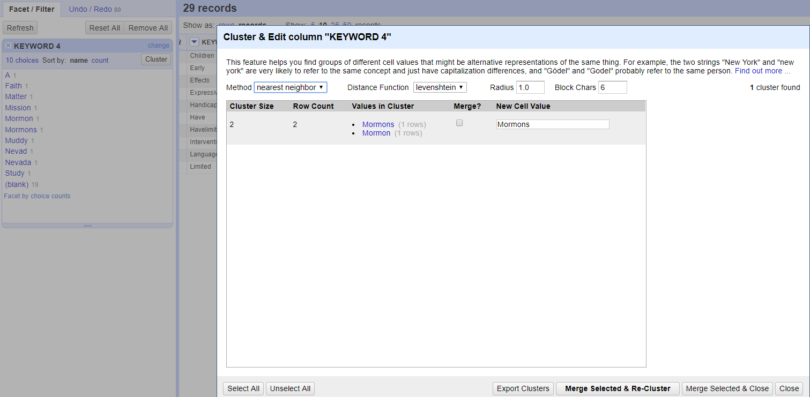

# Lesson

 
"**Image of raw data of keywords for a record set**"

 
"**In this situation, we are choosing to transpose cells in rows, into columns in order to weed out duplicate keyterms attached to one record**"

 
"**Similar to splitting columns, you can also split multi-valued cells by a delimiter**"

 
"**Now each record is represented by a column of keywords**"

 
"**We can adjust the capitalization of the keywords by transforming the data in the cells to Titlecase**"

 
"**Keywords are now in title case**"

## Faceting and Filtering

Facets are one of the most useful features of OpenRefine and can help both get an overview of the data in a project as well as helping you bring more consistency to the data.

A 'Facet' groups all the values that appear in a column, and then allow you to filter the data by these values and edit values across many records at the same time. The facet information always appears in the left hand panel in the OpenRefine interface.

## Text Facets

The simplest type of Facet is called a 'Text facet'. This simply groups all the text values in a column and lists each value with the number of records it appears in. 

To create a Text Facet for a column, click on the drop down menu at the top of the publisher column and choose `Facet -> Text Facet`. The facet will then appear in the left hand panel.

This facet consists of a list of values used in the data. You can filter the data displayed by clicking on one of these headings.

You can include multiple values from the facet in a filter at one time by using the `Include` option which appears when you put your mouse over a value in the Facet.

You can also `invert` the filter to show all records which do not match your selected values. This option appears at the top of the Facet panel when you select a value from the facet to apply as a filter.

>## Let's create a text facet
>1. Click on the drop down menu at the top of the publisher column and choose `Facet > Text Facet`. The facet will then appear in the left hand panel
>2. Filter by facet by clicking or `include`
>3. Select multiple values to `include`
>3. You can 'invert' your selections to `exclude`
>4. Include a value and then look at top to invert inclusion.
{: .checklist}

 

 
"**All of the facets will appear on the left side, from here you can directly edit the content of any of these facets by clicking on them**"

[More on faceting](https://github.com/OpenRefine/OpenRefine/wiki/Faceting)

## Filters
As well as using Facets to filter the data displayed in OpenRefine you can also apply 'Text Filters' which looks for a particular piece of text appearing in a column. Text filters are applied by clicking the drop down menu at the top of the column you want to apply the filter to and choosing 'Text filter'.

As with Facets, the Filter options appear in the left hand panel in OpenRefine. Simply type in the text you want to use in the Filter to display only rows which contain that text in the relevant column.

 

You can also use [regular expressions](https://librarycarpentry.github.io/lc-data-intro/04-regular-expressions/) in the filter.

## Working with filtered data
It is very important to note that when you have filtered the data displayed in OpenRefine, any operations you carry out will apply only to the rows that match the filter - that is the data currently being displayed.

## Other Types of Facets
As well as 'Text facets' Refine also supports a range of other types of faceting. These include:

* Numeric facets
* Timeline facets (for dates)
* Custom facets
* Scatterplot facets

**Numeric and Timeline facets** display graphs instead of lists of values. The graph includes 'drag and drop' controls you can use to set a start and end range to filter the data displayed.

**Scatterplot facets** are less commonly used - for further information on these see the tutorial at [http://enipedia.tudelft.nl/wiki/OpenRefine_Tutorial#Exploring_the_data_with_scatter_plots](http://enipedia.tudelft.nl/wiki/OpenRefine_Tutorial#Exploring_the_data_with_scatter_plots)

**Custom facets** are a range of different types of facets. Some of the default custom facets are:

* Word facet - this breaks down text into words and counts the number of records each word appears in
* Duplicates facet - this results in a binary facet of 'true' or 'false'. Rows appear in the 'true' facet if the value in the selected column is an exact match for a value in the same column in another row
* Text length facet - creates a numeric facet based on the length (number of characters) of the text in each row for the selected column. This can be useful for spotting incorrect or unusual data in a field where specific lengths are expected (e.g. if the values are expected to be years, any row with a text length more than 4 for that column is likely to be incorrect)
* Facet by blank - a binary facet of 'true' or 'false'. Rows appear in the 'true' facet if they have no data present in that column. This is useful when looking for rows missing key data.

 
"**How to run duplicates facet**"

 
"**When 'true' is selected, OpenRefine will show the rows that contain duplicate values. You will notice that all empty rows are considered to have the value, NULL, and therefore are counted as duplicates**"

Facets are intended to group together common values and OpenRefine limits the number of values allowed in a single facet to ensure the software does not perform slowly or run out of memory. If you create a facet where there are many unique values (for example, a facet on a 'book title' column in a data set that has one row per book) the facet created will be very large and may either slow down the application, or OpenRefine will not create the facet.

## Clustering

In OpenRefine, clustering means "finding groups of different values that might be alternative representations of the same thing". For example, the two strings `New York` and `new york` are very likely to refer to the same concept and just have capitalization differences. Likewise, `Gödel` and `Godel` probably refer to the same person. Clustering is a very powerful tool for cleaning datasets which contain misspelled or mistyped entries. OpenRefine has several clustering algorithms built in. Experiment with them, and learn more about these algorithms and how they work. 

1. In the `Keyword 4` Text Facet we created in the earlier, click the `Cluster` button.
2. In the resulting pop-up window, you can change the `Method` and the `Keying Function`. Try different combinations to 
 see what different mergers of values are suggested.
3. Select the `nearest neighbor` method and `levenshtein` distance function. It should identify one clusters. 

4. Click the `Merge?` box beside each, then click `Merge Selected and Recluster` to apply the corrections to the dataset.
5. Try selecting different `Methods` and `Keying Functions` again, to see what new merges are suggested. You may find there are 
 still improvements that can be made, but don't `Merge` again; just `Close` when you're done.  We'll now 
 see other operations that will help us detect and correct the remaining problems, and that have other, more general uses.

 "**Switching Methods to `key collision` allows you to identify other potential clusters. Adjusting the `Ngram Size` will allow you to find the words that could be clustered based on natural language processing identifying the nearest possible phoneme/syllable/base pair**"

[More on clustering](https://github.com/OpenRefine/OpenRefine/wiki/Clustering-In-Depth)

## Numbers

When a table is imported into OpenRefine, all columns are treated as having text values. We saw earlier how we can sort column values as numbers, but this does not change the cells in a column from text to numbers. Rather, this interprets the values as numbers for the purposes of sorting but keeps the underlying data type as is. We can, however, transform columns to other data types (e.g. number or date) using the `Edit cells` > `Common transforms` feature. Here we will experiment changing columns to numbers and see what additional capabilities that grants us.

Be sure to remove any `Text filter` facets you have enabled from the left panel so that we can examine our whole dataset. You can remove an existing facet by clicking the `x` in the upper left of that facet window.

To transform cells in the `recordID` column to numbers, click the down arrow for that column, then `Edit cells` > `Common transforms…` > `To number`. You will notice the `recordID` values change from left-justified to right-justified, and black to green color.
